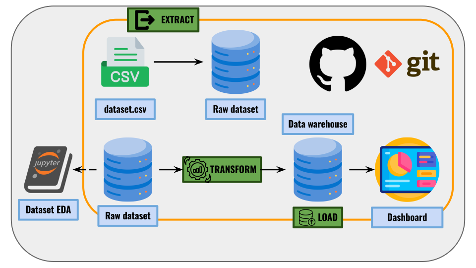
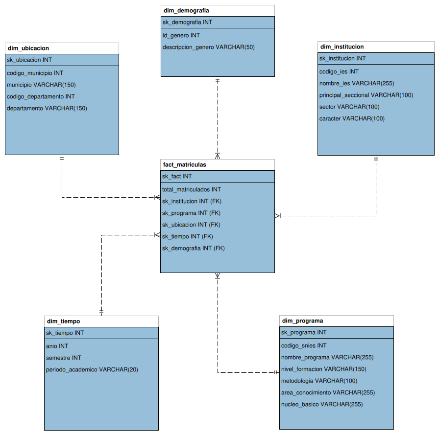
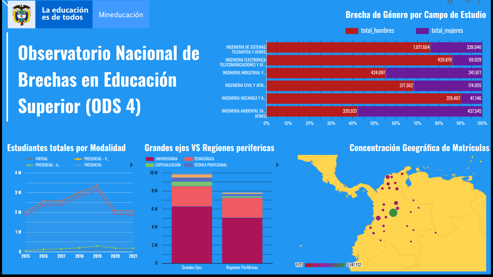

# 🇨🇴 Observatorio Nacional de Brechas en Educación Superior (ODS 4)
**Proyecto ETL - Primera Entrega | Ingeniería de Datos e Inteligencia Artificial** R
*Nicole Valeria Ruiz Valencia- Isabela Manchabajoy Padilla- Santiago Ituyan Figueroa- Juan Estevan Viera Cano*



## 1. Escenario de Negocio (Business Scenario)
Este proyecto nace como una solución analítica para el **Ministerio de Educación Nacional de Colombia (MEN)**. 

El objetivo de negocio es diseñar e implementar un **Data Warehouse histórico de matrículas universitarias** que permita al gobierno identificar "Desiertos Educativos" (regiones con alta demanda pero baja oferta) y visualizar las brechas de acceso geográficas, de género y de formación. Esta inteligencia estructurada es vital para justificar y focalizar estratégicamente el presupuesto de inversión en infraestructura, conectividad virtual y subsidios de educación superior pública para la próxima década.

Este proyecto atiende de forma directa la meta principal del **Objetivo de Desarrollo Sostenible (ODS) 4: Educación de Calidad**, garantizando el monitoreo del acceso equitativo a la educación técnica, tecnológica y universitaria.

## 2. Justificación del Dataset (Dataset Justification)
Se seleccionó el dataset oficial de **"Estadísticas de Matrículas en Educación Superior" (SNIES)** provisto por el portal de Datos Abiertos del Gobierno de Colombia. Se tomó la descripcion de las columnas ofrecida por la pagina y se sintetizó en un .csv dentro de *data/raw/educacionCol_descripcion_columnas_dataset.csv".
* **Volumen:** ~390,000 registros crudos.
* **Granularidad:** Detalles de matrículas agrupadas por Año, Semestre, Institución, Programa, Municipio, Metodología y Género.
* **¿Por qué este dataset?:** Es el *Single Source of Truth* a nivel gubernamental. Su riqueza en jerarquías geográficas e institucionales permite construir un esquema en estrella (*Star Schema*) robusto que responda exactamente a las necesidades del ODS 4.

## 3. Arquitectura de Datos y Diseño del Star Schema
El proyecto implementa una arquitectura **Kimball (Dimensional Modeling)** desplegada sobre un motor MySQL.

### Definición del Grano (Grain Definition)
> *"El número total de estudiantes matriculados por cada combinación única de Programa Académico, Institución, Municipio de Oferta, Semestre, Año y Género."*

### Decisiones de Diseño (Design Decisions)
Para garantizar la integridad y escalabilidad del Data Warehouse, se tomaron las siguientes decisiones de diseño:
1. **Surrogate Keys:** Ninguna dimensión utiliza los códigos del gobierno (ej. SNIES) como llave primaria. Se implementaron llaves sintéticas autoincrementales (`sk_institucion`, `sk_programa`, etc.) para proteger el modelo de cambios en las normativas de codificación del gobierno.
2. **Desacoplamiento de Demografía:** El género (1=Masculino, 2=Femenino) se extrajo a su propia dimensión `dim_demografia`. Esto evita repetir cadenas de texto pesadas en la tabla de hechos (*Fact Table*) de 200k filas y facilita la futura adición de variables demográficas (ej. Estrato socioeconómico o Edad) sin rediseñar el modelo.
3. **Mapeo Ultra-Ligero en RAM:** La fase de carga (`Load`) utiliza un mapeo de llaves foráneas basado en diccionarios de Python (*Hash Maps*) en lugar de uniones de Pandas (`pd.merge()`), reduciendo el consumo de memoria RAM en más del 90% para prevenir errores de tipo *Out Of Memory*.

### Diagrama del Modelo Dimensional


## 4. Lógica ETL y Calidad de Datos (ETL Logic & Data Quality)

El pipeline (`main.py`) orquesta tres fases modulares ubicadas en el directorio `src/`:

* **Extract:** Ingesta del archivo CSV crudo mediante Pandas optimizando el casteo de tipos iniciales.
* **Transform:**
  * **Duplicados Exactos (Data Quality):** Se asumió que ~106,000 filas 100% idénticas (en todas sus 26 columnas) se debían a errores de consolidación de reportes del Ministerio. Fueron eliminadas mediante `drop_duplicates()` para no inflar las métricas nacionales.
  * **Estandarización Geográfica:** El dataset crudo reportaba 54 departamentos debido a errores tipográficos. Se implementó una función de limpieza (eliminación de tildes, puntuación y homologación manual mediante diccionarios) que corrigió y consolidó la geografía colombiana a los **33 departamentos oficiales** (incluyendo Bogotá D.C.).
  * **Consolidación del Grano:** Agrupación final (`groupby.sum()`) que consolidó la métrica `total_matriculados` reduciendo el ruido a 229,008 hechos concretos.
* **Load:** Conexión vía **SQLAlchemy**, población independiente de 5 tablas dimensionales, captura de *Surrogate Keys* generadas por MySQL, y volcado masivo en lotes (`chunksize`) a la tabla `fact_matriculas`.

## 5. Visualización (Business Intelligence)
Se conectó el Data Warehouse a Google Looker Studio para generar un dashboard interactivo que responde a las preguntas analíticas de negocio:



*(Las consultas analíticas de SQL utilizadas para alimentar la herramienta de Business Intelligence están disponibles y comentadas en `sql/bi_queries.sql`)*

## 6. Instrucciones de Ejecución (How to Run the Project)

### Prerrequisitos
* Python 3.12+
* Servidor MySQL (Local o Remoto).

### Configuración (Setup)
1. **Crear y activar entorno virtual:**
   ```bash
   python -m venv .venv
   source .venv/bin/activate  # En Linux/Mac
   .venv\Scripts\activate     # En Windows
   ```

2. **Instalar dependencias:**
   ```bash
   pip install -r requirements.txt
   ```

3. **Descargar el data set**
   Descarga el dataset aquí: https://www.datos.gov.co/Educaci-n/MEN_MATRICULA_ESTADISTICA_ES/5wck-szir/about_data
   y guardalo en la carpeta data/raw/educacionCol.csv

4. **Variables de Entorno (.env):**
   Crea un archivo `.env` en la raíz del proyecto con tus credenciales locales:
   ```env
   DB_USER=root
   DB_PASSWORD=tu_password
   DB_HOST=localhost
   DB_PORT=3306
   DB_NAME=dw_matriculas_col
   ```

### Ejecución
Corre el pipeline principal. El script resolverá automáticamente las rutas relativas sin importar tu sistema operativo:
```bash
python main.py # O el comando con el que ejecutas tus scripts de python
python3 main.py
py main.py 
```
## 7. Salida Esperada
Al finalizar el pipeline, verás un log en terminal validando la carga de más de 200k hechos y se exportará un archivo `educacionCol_clean.csv` en `data/processed/` para validaciones manuales.

```text
==================================================
🚀 INICIANDO PIPELINE ETL - PROYECTO ODS COLOMBIA 🚀
==================================================
🔌 Conexión a la base de datos establecida correctamente.

--- FASE 1: EXTRACCIÓN (E) ---
...
--- FASE 2: TRANSFORMACIÓN (T) ---
...
   - Se estandarizaron los nombres de todos los Departamentos y Municipios.
...
--- FASE 3: CARGA (L) ---
...
   -> Cargando fact_matriculas en BD...
      ✅ Hechos cargados. Total de registros insertados: 229008
🎉 Proceso de Carga Finalizado con Éxito.
```