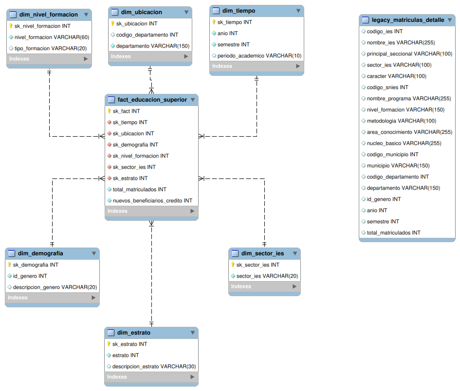
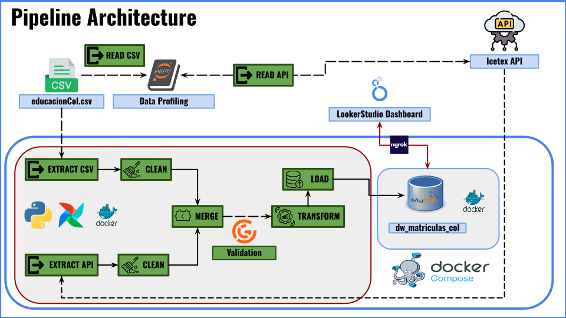
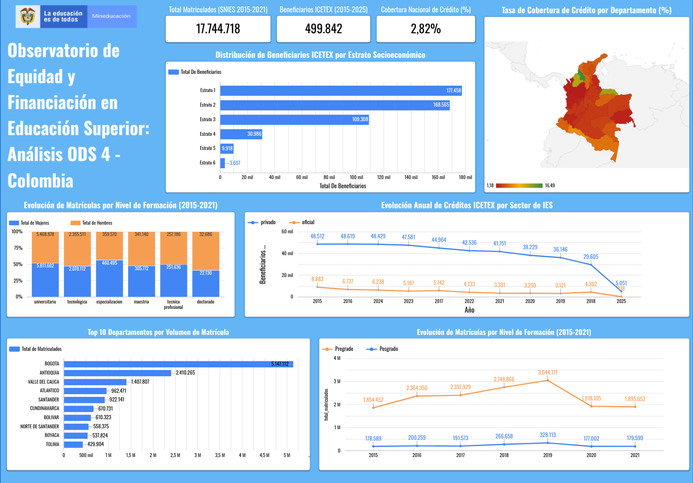
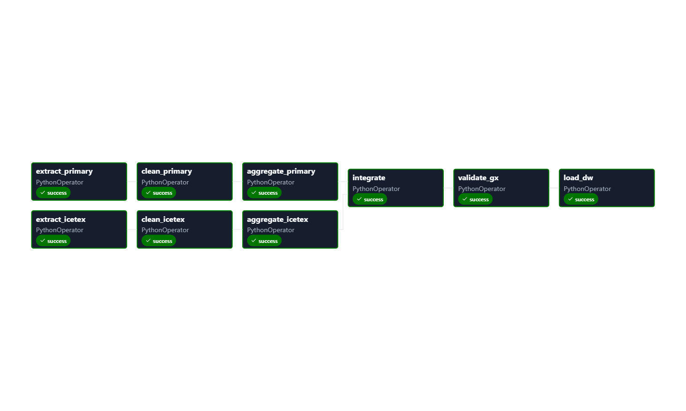

# Observatorio de Acceso y Financiación a la Educación Superior (ODS 4)
**Proyecto ETL — Segunda Entrega | Ingeniería de Datos e Inteligencia Artificial**

---

## Tabla de Contenido

1. [Objetivos de Negocio Refinados](#1-objetivos-de-negocio-refinados)
2. [Fuentes de Datos](#2-fuentes-de-datos)
3. [Resumen de Perfilado de Datos](#3-resumen-de-perfilado-de-datos)
4. [Modelo Dimensional](#4-modelo-dimensional-star-schema)
5. [Estrategia de Integración y Supuestos](#5-estrategia-de-integración-y-supuestos)
6. [Explicación del Pipeline ETL](#6-explicación-del-pipeline-etl)
7. [Estrategia de Validación (Great Expectations)](#7-estrategia-de-validación-great-expectations)
8. [Consultas BI y Dashboard](#8-consultas-bi-y-dashboard)
9. [Estructura del Proyecto](#9-estructura-del-proyecto)
10. [Instrucciones de Ejecución](#10-instrucciones-de-ejecución-local)
11. [Diseño del DAG de Airflow](#11-diseño-del-dag-de-airflow)

---

## 1. Objetivos de Negocio Refinados

La primera entrega construyó un Data Warehouse sobre las **matrículas** de educación superior (dataset SNIES del MEN), permitiendo analizar la distribución de la oferta educativa a nivel departamental, institucional y por programa.

En esta segunda entrega el objetivo evoluciona hacia una visión más profunda del **acceso efectivo a la educación superior**, integrando los **créditos educativos otorgados por el ICETEX**.

> "Analizar la cobertura de la financiación estatal (ICETEX) y su correlación con la oferta educativa (SNIES), identificando dónde están los estudiantes, quiénes pueden financiar sus estudios, en qué tipo de institución y desde qué estrato socioeconómico. Esto permite medir la equidad del sistema y la efectividad de las políticas de crédito respecto al ODS 4."

Preguntas analíticas que habilita la integración:

- ¿Cuál es la tasa de cobertura de crédito por departamento? ¿Existen "desiertos de financiación"?
- ¿La financiación del ICETEX llega equitativamente a todos los estratos socioeconómicos?
- ¿Hay preferencia de créditos hacia el sector público o privado? ¿Ha cambiado en el tiempo?
- ¿Qué brecha de género existe en el acceso al crédito según el nivel de formación?

---

## 2. Fuentes de Datos

### 2.1. Fuente Primaria — Matrículas SNIES (CSV)

| Atributo | Valor |
|---|---|
| Origen | `datos.gov.co` — Estadísticas de Matrículas en Educación Superior |
| Ruta local | `airflow/data/raw/educacionCol.csv` |
| Volumen | ~390,000 registros (2015–2021) |
| Granularidad original | IES × Programa × Municipio × Año × Semestre × Género |
| Métricas aportadas | `total_matriculados` |
| Dimensiones aportadas | Institución, Programa, Municipio, Departamento, Nivel, Sector, Género |

### 2.2. Fuente Secundaria — Créditos ICETEX (API Socrata)

| Atributo | Valor |
|---|---|
| Origen | Portal `datos.gov.co` — API Socrata |
| Endpoint | `https://www.datos.gov.co/resource/26bn-e42j.json` |
| Autenticación | Header `X-App-Token` (opcional, aumenta rate limit) |
| Paginación | `$limit` / `$offset` (páginas de 50,000 registros) |
| Volumen | ~107,000 registros (2015–2025) |
| Granularidad original | Año × Semestre × Departamento de origen × Nivel × Sector IES × Género × Estrato × Modalidad |
| Métricas aportadas | `nuevos_beneficiarios_credito` |
| Dimensión exclusiva | **Estrato socioeconómico** (no disponible en SNIES) |

**Justificación de elección:** El estrato socioeconómico es la variable de equidad clave para el ODS 4. Ninguna otra fuente pública disponible en `datos.gov.co` combina estrato + nivel de formación + departamento + género con cobertura nacional, lo que hace a ICETEX la única opción que enriquece cualitativamente el modelo.

---

## 3. Resumen de Perfilado de Datos

### 3.1. Dataset Primario (SNIES)

Realizado en la primera entrega. Hallazgos principales:

- **Nulos**: columna `Total Matriculados` presenta ~0.3% de nulos; se imputan con 0 y se filtran registros con matrícula ≤ 0.
- **Duplicados**: presencia de duplicados exactos (~2%); eliminados con `drop_duplicates()`.
- **Tipos**: `Id_Nivel_Formacion` e `Id_Sector` son enteros numéricos que requieren mapeo a etiquetas de texto.
- **Inconsistencias geográficas**: múltiples variantes del mismo departamento (`bogota dc`, `bogota, d.c.`, `narinio` por `narino`, etc.); corregidas con diccionario de homologación.
- **Niveles de formación**: IDs 1–10, donde 4/7/8/10 corresponden a variantes de Especialización.

### 3.2. Dataset API (ICETEX)

Realizado en la Fase 0 (notebook `notebooks/eda.ipynb`). Hallazgos que impactan el pipeline:

| Problema identificado | Impacto | Solución en `clean_icetex` |
|---|---|---|
| `VIGENCIA` como string limpio (sin coma de miles) | Casteo directo a int | `pd.to_numeric()` |
| `PERIODO OTORGAMIENTO` formato `"YYYY-[1\|2]"` | Extraer semestre | `str.split('-').str[1]` |
| `SEXO AL NACER` incluye `Intersexual` (14 filas, 0.01%) | Descartar para FK válida | Filtro previo al mapeo |
| `Bogotá, D.C.` con coma y mayúsculas en depto | Desalineación con SNIES | `clean_text()` + reemplazo `'bogota, d.c.' → 'bogota'` |
| `Archipiélago de San Andrés...` nombre completo | Mismo problema | Reemplazo a `'san andres y providencia'` |
| 11 valores distintos de nivel de formación | No coinciden con los 6 del primario | Diccionario de 11→7 canónicos |
| `NIVEL DE FORMACIÓN = 'Exterior'` (9,154 filas, 8.6%) | Nivel sin equivalente en SNIES | Se conserva como valor `'exterior'`; filas con solo beneficiarios |
| `NIVEL = 'Normalista'` (7 filas) | Fuera del alcance del DW | Descartado |
| `SECTOR IES = 'N/A'` (9,184 filas, 8.5%) | FK no resolvible | Mapeado a `'desconocido'` |
| `ESTRATO ∈ {1..6}` sin outliers, sin nulos | Puede integrarse directamente | Cast a int, sin imputación |
| Rango de años: 2015–2025 | 4 años extra vs primario (2015–2021) | Expectation GX ajustada a 2015–2025 |

**Convención de casing:** todos los valores de dominio (`nivel_formacion`, `sector_ies`) se almacenan en **minúsculas** en todo el pipeline (transform → fact table → queries BI).

---

## 4. Modelo Dimensional (Star Schema)

### 4.1. Decisión de diseño: grano agregado

El grano de la primera entrega (IES × Programa × Municipio) es incompatible con ICETEX (que solo provee departamento, no municipio ni programa). Para integrar ambas fuentes se redujo el grano al **denominador común**:

> Un registro por `(anio, semestre, departamento, nivel_formacion, sector_ies, genero, estrato)`

Sacrificio documentado: se pierde la granularidad de IES, Programa, Municipio, Metodología y Área del primario a nivel del star schema. Esta reducción fue necesaria para habilitar la integración con ICETEX y enfocar el análisis en las preguntas de equidad y cobertura que motivan la segunda entrega.

Como mitigación, el pipeline también carga la tabla `legacy_matriculas_detalle` y crea la vista `vw_matriculas_detalle`, que preserva la granularidad fina del SNIES (IES, Programa, Municipio, Núcleo Básico, Metodología, Área). **Esta vista se implementó pero no se utilizó en las consultas finales del dashboard**, que se enfocan exclusivamente en el modelo dimensional integrado. Queda disponible como activo para análisis ad hoc que requieran el detalle original.



### 4.2. Tabla de Hechos: `fact_educacion_superior`

| Columna | Tipo | Descripción |
|---|---|---|
| `sk_fact` | INT PK | Surrogate key autoincrementable |
| `sk_tiempo` | INT FK | → `dim_tiempo` |
| `sk_ubicacion` | INT FK | → `dim_ubicacion` |
| `sk_demografia` | INT FK | → `dim_demografia` |
| `sk_nivel_formacion` | INT FK | → `dim_nivel_formacion` |
| `sk_sector_ies` | INT FK | → `dim_sector_ies` |
| `sk_estrato` | INT FK | → `dim_estrato` |
| `total_matriculados` | INT | Métrica SNIES (0 si la combinación no existe en SNIES) |
| `nuevos_beneficiarios_credito` | INT | Métrica ICETEX (0 si la combinación no existe en ICETEX) |

Restricción de unicidad: `UNIQUE KEY uk_grain (sk_tiempo, sk_ubicacion, sk_demografia, sk_nivel_formacion, sk_sector_ies, sk_estrato)`.

### 4.3. Dimensiones conformadas (6)

| Dimensión | Campos clave | Notas |
|---|---|---|
| `dim_tiempo` | `anio`, `semestre`, `periodo_academico` (columna generada) | Reutilizada |
| `dim_ubicacion` | `departamento`, `codigo_departamento` (nullable) | Reducida de municipio a depto |
| `dim_demografia` | `id_genero`, `descripcion_genero` | Reutilizada; enriquecida post-carga |
| `dim_nivel_formacion` | `nivel_formacion`, `tipo_formacion` (Pregrado/Posgrado) | Nueva; derivada de dim_programa |
| `dim_sector_ies` | `sector_ies` (oficial/privado/desconocido) | Nueva; derivada de dim_institucion |
| `dim_estrato` | `estrato` (0..6), `descripcion_estrato` | Nueva; pre-poblada por DDL |

---

## 5. Estrategia de Integración y Supuestos

### Mecanismo de integración

1. Ambos datasets se limpian y agregan independientemente al grano común (7 llaves).
2. Se realiza un `FULL OUTER JOIN` para preservar todos los registros de ambas fuentes.
3. `total_matriculados = 0` donde ICETEX no tiene contraparte en SNIES (ej. créditos al exterior).
4. `nuevos_beneficiarios_credito = 0` donde SNIES no tiene contraparte en ICETEX (mayoría de combinaciones del primario).

### Supuesto crítico documentado

La dimensión `dim_ubicacion` se trata a nivel **departamento** como proxy conformado entre las dos fuentes:
- En SNIES: departamento de **oferta del programa** (dónde está la IES).
- En ICETEX: departamento de **origen del estudiante** (dónde nació o reside).

Se asume que, a nivel agregado, estos son intercambiables para análisis estratégicos (la mayoría de los estudiantes estudian cerca de su lugar de origen). Esta aproximación introduce ruido en regiones con alta migración estudiantil (Bogotá, Medellín), documentado explícitamente para el consumidor del dashboard.

---

## 6. Explicación del Pipeline ETL



### Módulos del pipeline

| Módulo | Función principal | Responsabilidad |
|---|---|---|
| `config.py` | — | Lee `airflow/.env`; expone rutas y URLs como constantes |
| `extract.py` | `extract_data()`, `extract_icetex_api()` | CSV + API con paginación y reintentos por petición |
| `transform.py` | `clean_primary()`, `aggregate_primary()`, `clean_icetex()`, `aggregate_icetex()` | Limpieza, homologación y agregación de ambas fuentes |
| `integrate.py` | `integrate_sources()` | FULL OUTER JOIN + fillna(0) sobre las 7 llaves |
| `validate.py` | `run_validation()` | Suite Great Expectations (Fase B) |
| `load.py` | `load_data()` | 6 dims + fact con dict-mapping anti-OOM |
| `main.py` | `main()`, `init_database_if_not_exists()` | Orquestador; auto-crea el schema si no existe |

### Decisión de diseño: surrogate keys con diccionarios

El mapeo de llaves foráneas se realiza con `set_index().to_dict()` + `Series.map()` en lugar de `pd.merge()`. Esto evita explosiones de memoria en datasets grandes (anti-OOM pattern), a costa de mayor verbosidad en el código. Cada dimensión se carga, se relee para obtener sus SKs generadas, y el dict resultante se usa para mapear la columna correspondiente en el fact DataFrame.

---

## 7. Estrategia de Validación (Great Expectations)

La suite `fact_educacion_superior_suite` se ejecuta sobre el DataFrame integrado **antes** de la carga a MySQL. Un fallo en cualquier expectativa crítica aborta el pipeline con `sys.exit(1)`.

### Expectativas críticas (14 — abortan el pipeline)

| # | Tipo | Columna | Justificación |
|---|---|---|---|
| 1–7 | `ExpectColumnValuesToNotBeNull` | `anio`, `semestre`, `departamento`, `nivel_formacion`, `sector_ies`, `id_genero`, `estrato` | Claves de negocio obligatorias |
| 8–9 | `ExpectColumnValuesToBeBetween(min=0)` | `total_matriculados`, `nuevos_beneficiarios_credito` | Métricas aditivas, no negativas |
| 10 | `ExpectColumnValuesToBeInSet([0..6])` | `estrato` | `0=Desconocido` (SNIES), `1..6` (ICETEX) |
| 11 | `ExpectColumnValuesToBeInSet(7 valores)` | `nivel_formacion` | Dominio canónico en minúsculas |
| 12 | `ExpectColumnValuesToBeInSet(['oficial','privado','desconocido'])` | `sector_ies` | `N/A` ICETEX → `desconocido` |
| 13 | `ExpectColumnValuesToBeInSet([1,2])` | `id_genero` | `Intersexual` descartado en clean_icetex |
| 14 | `ExpectColumnValuesToBeBetween(2015, 2025)` | `anio` | Rango real: SNIES 2015–2021, ICETEX 2015–2025 |

### Expectativas no críticas (2 — solo warning)

| # | Tipo | Justificación |
|---|---|---|
| 15 | `ExpectTableRowCountToBeBetween(5000, 150000)` | Sanity check de volumen |
| 16 | `ExpectColumnValuesToBeInSet(semestre, [1, 2])` | Semestre académico válido |

### Implementación técnica

- **GX v1.16.1** con Fluent API y contexto de archivo (`mode="file"`, raíz en `gx/`).
- Dos suites (`critical_suite`, `non_critical_suite`) ejecutadas por un único checkpoint (`etl_checkpoint`).
- `UpdateDataDocsAction` genera reportes HTML navegables en `gx/uncommitted/data_docs/local_site/`.
- Para visualizar los resultados: `xdg-open gx/uncommitted/data_docs/local_site/index.html`.

---

## 8. Consultas BI y Dashboard

Las queries que alimentan el dashboard están en `sql/bi_queries.sql` y se agrupan en dos bloques que corresponden uno a uno con los gráficos publicados en Looker Studio. La sección 3 del archivo SQL (consultas sobre `vw_matriculas_detalle`) no se utilizó en el dashboard final.

### 8.1. Consultas de Integración (SNIES + ICETEX)

Estas consultas son el valor diferencial de la segunda entrega: solo son posibles gracias a la integración de ambas fuentes en una única fact table. Cruzan las métricas `total_matriculados` (SNIES) y `nuevos_beneficiarios_credito` (ICETEX) para responder preguntas de equidad y cobertura.

| Query | Descripción | Agregación / Métrica | Visualización |
|---|---|---|---|
| 1.1 | **Tasa de cobertura de crédito por departamento** — identifica "desiertos de financiación" donde hay alta matrícula pero baja penetración de créditos ICETEX. | `SUM(beneficiarios) / NULLIF(SUM(matriculados), 0) * 100` → `tasa_cobertura_credito_pct` por `dim_ubicacion.departamento` | Mapa coroplético de Colombia |
| 1.2 | **Distribución de beneficiarios de crédito por estrato socioeconómico** — mide la equidad: ¿a qué estratos llega más la financiación? Se reporta volumen absoluto y porcentaje del total nacional (excluyendo `estrato=0` imputado para SNIES). | `SUM(beneficiarios)` y `% del total` por `dim_estrato.descripcion_estrato` | Barras horizontales |
| 1.3 | **Tendencia de créditos por sector de IES (oficial vs privado) por año** — analiza si los créditos se dirigen más a IES públicas o privadas a lo largo del tiempo. Excluye `sector_ies='desconocido'`. | `SUM(matriculados)` y `SUM(beneficiarios)` por `dim_tiempo.anio` × `dim_sector_ies.sector_ies` | Líneas / áreas apiladas |

### 8.2. Consultas sobre el Modelo Dimensional Agregado

Aprovechan el grano del star schema (`fact_educacion_superior` + dimensiones conformadas).

| Query | Descripción | Agregación / Métrica | Visualización |
|---|---|---|---|
| 2.1 | **Evolución temporal de matrículas por nivel de formación** — excluye `nivel_formacion='exterior'`. | `SUM(matriculados)` por `dim_tiempo.anio` × `dim_nivel_formacion.nivel_formacion` | Líneas múltiples |
| 2.2 | **Top 10 departamentos por volumen de matrícula** — incluye `porcentaje_nacional` respecto al total del país. | `SUM(matriculados)` y `% nacional` por `dim_ubicacion.departamento`, ordenado DESC, `LIMIT 10` | Barras horizontales |
| 2.3 | **Brecha de género por nivel de formación** — compara hombres vs mujeres por nivel (pregrado/posgrado), con `porcentaje_mujeres`. Excluye `exterior` y `desconocido`. | `SUM(CASE ... id_genero ...)` por `dim_nivel_formacion` | Barras agrupadas |

### 8.3. Dashboard (Looker Studio)

El dashboard interactivo fue construido en **Google Looker Studio**, conectado directamente al Data Warehouse MySQL (`dw_matriculas_col`) mediante el conector oficial de MySQL. Cada gráfico se alimenta de una **tabla personalizada** con la query correspondiente de `sql/bi_queries.sql`; los KPIs superiores se calculan con campos agregados directamente sobre la fact table.

**KPIs principales (tarjetas de resumen):**

- **Total Matriculados (SNIES 2015–2021)** = `SUM(total_matriculados)`
- **Beneficiarios ICETEX (2015–2025)** = `SUM(nuevos_beneficiarios_credito)`
- **Cobertura Nacional de Crédito (%)** = `SUM(nuevos_beneficiarios_credito) / SUM(total_matriculados) * 100`

**Filtros interactivos:** `anio`, `departamento`, `sector_ies` (aplicados globalmente mediante grupos de filtros de Looker).

**Referencia rápida — fuente de cada componente del dashboard:**

| Componente del dashboard | Fuente en el DW | Query |
|---|---|---|
| KPIs superiores | `fact_educacion_superior` (tabla completa) | — |
| Mapa de cobertura por departamento | Tabla personalizada | Query 1.1 |
| Beneficiarios por estrato | Tabla personalizada | Query 1.2 |
| Tendencia por sector de IES | Tabla personalizada | Query 1.3 |
| Evolución por nivel de formación | Tabla personalizada | Query 2.1 |
| Top 10 departamentos | Tabla personalizada | Query 2.2 |
| Brecha de género por nivel | Tabla personalizada | Query 2.3 |



---

## 9. Estructura del Proyecto

Estructura plana, sin packaging: `main.py` se ejecuta directamente desde la raíz y el DAG de Airflow inserta `/opt/airflow/src` en `sys.path`. Los directorios marcados como *gitignored* existen en disco pero no se versionan; los archivos bajo `gx/` se generan automáticamente en el primer run del pipeline.

```
project_delivery_2/
├── airflow/                                        # infra Airflow + Docker + datos
│   ├── docker-compose.yaml                         # servicios airflow + mysql-dw
│   ├── .env                                        # credenciales reales (gitignored)
│   ├── .env.example                                # plantilla de credenciales
│   ├── requirements.txt                            # deps de los contenedores Airflow
│   ├── config/                                     # config Airflow (gitignored, contiene .gitkeep)
│   ├── dags/
│   │   └── etl_ods4.py                             # DAG: inserta /opt/airflow/src en sys.path
│   ├── data/
│   │   ├── raw/
│   │   │   ├── educacionCol.csv                    # dataset primario SNIES (gitignored)
│   │   │   ├── descripcion_dataset_api.txt         # documentación de la API ICETEX
│   │   │   └── educacionCol_descripcion_columnas_dataset.csv
│   │   ├── processed/                              # CSVs limpios exportados (gitignored)
│   │   │   ├── educacionCol_clean.csv
│   │   │   ├── educacionCol_aggregated.csv
│   │   │   └── creditos_icetex_clean.csv
│   │   └── staging/                                # pickles intermedios del DAG (*.pkl, gitignored)
│   ├── logs/                                       # logs Airflow (gitignored)
│   └── plugins/
├── src/                                            # código del pipeline (flat, sin subpaquetes)
│   ├── main.py                                     # entry point: python src/main.py
│   ├── config.py                                   # carga airflow/.env, expone rutas y URLs
│   ├── extract.py                                  # extract_data (CSV) + extract_icetex_api
│   ├── transform.py                                # clean/aggregate primary + icetex
│   ├── integrate.py                                # FULL OUTER JOIN de ambas fuentes
│   ├── load.py                                     # 6 dims + fact con dict-mapping anti-OOM
│   └── validate.py                                 # runner Great Expectations
├── sql/
│   ├── init_dw_matriculas_col.sql                  # DDL: 6 dims + fact
│   ├── bi_queries.sql                              # queries analíticas del dashboard
│   ├── vw_matriculas_detalle.sql                   # vista auxiliar (implementada, no usada en dashboard)
│   ├── workbench_diagram.mwb                       # modelo MySQL Workbench
│   └── workbench_diagram.mwb.bak
├── gx/                                             # Great Expectations (auto-generado, gitignored)
│   ├── great_expectations.yml
│   ├── expectations/
│   ├── checkpoints/
│   └── uncommitted/data_docs/                      # reportes HTML navegables
├── notebooks/
│   └── eda.ipynb                                   # EDA + profiling de ambas fuentes
├── diagrams/
│   ├── architecture_diagramV2.svg                  # arquitectura del pipeline
│   ├── star_schemma_dw_matriculas_colV2.svg/.png   # modelo dimensional
│   ├── classic_star_schemma_dw_matriculas_col.*    # modelo clásico (1ra entrega)
│   ├── dag_disign.png                              # diseño del DAG
│   ├── dashboard_lookerV2.png                      # captura del dashboard
│   └── dashboard_ODS4.png
├── requirements.txt                                # deps del pipeline local
├── ETL_ETLProject_SecondDelivery.pdf               # enunciado de la entrega
├── ETL_ETLProject_FirstDelivery.pdf
├── .gitignore
└── README.md
```

**Convención de rutas en el código:**

- `src/main.py` resuelve `project_root = Path(__file__).resolve().parent.parent`.
- `.env` se carga desde `project_root / "airflow" / ".env"`.
- Datos crudos: `project_root / "airflow" / "data" / "raw"`.
- Datos procesados: `project_root / "airflow" / "data" / "processed"`.
- Scripts SQL: `project_root / "sql"`.
- Dentro de Docker, `airflow/data/` se monta en `/opt/airflow/data/`.

---

## 10. Instrucciones de Ejecución (Local)

### Prerrequisitos

- Python 3.12+
- Docker y Docker Compose (para MySQL)
- Dataset SNIES (`educacionCol.csv`) en `airflow/data/raw/`

### Paso 1 — Entorno virtual e instalación de dependencias

```bash
python3 -m venv .venv
source .venv/bin/activate
pip install -r requirements.txt
```

### Paso 2 — Variables de entorno

Copia `airflow/.env.example` a `airflow/.env` y edita las credenciales:

```bash
cp airflow/.env.example airflow/.env
```

```env
MYSQL_USER=root
MYSQL_PASSWORD=tu_password
MYSQL_HOST=127.0.0.1
MYSQL_PORT=3307
MYSQL_DW_DB=dw_matriculas_col
MYSQL_ROOT_PASSWORD=tu_password
SOCRATA_APP_TOKEN=          # Opcional; aumenta el rate limit de la API ICETEX
```

> Usa `127.0.0.1` (no `localhost`) si ejecutas el pipeline localmente contra el contenedor Docker.

### Paso 3 — Iniciar el servicio MySQL

```bash
cd airflow
docker compose up -d mysql-dw
```

Espera ~10 segundos a que el contenedor inicialice. El DDL se ejecutará automáticamente como init-script del contenedor Y también de forma lazy al inicio del pipeline (`init_database_if_not_exists`).

### Paso 4 — Ejecutar el pipeline

Desde la raíz del proyecto:

```bash
python3 src/main.py
```

El pipeline:
1. Verifica si la base de datos `dw_matriculas_col` existe; si no, ejecuta el DDL.
2. Extrae el CSV primario y consume la API de ICETEX (con paginación).
3. Limpia, transforma y agrega ambas fuentes.
4. Integra mediante FULL OUTER JOIN.
5. Carga 6 dimensiones y la tabla de hechos en MySQL.

### Salidas esperadas

```
airflow/data/processed/
  ├── educacionCol_clean.csv        # Dataset primario limpio (granularidad fina)
  ├── educacionCol_aggregated.csv   # Dataset primario agregado al grano común
  └── creditos_icetex_clean.csv     # Dataset ICETEX limpio y agregado
```

### Re-ejecución limpia

El pipeline **no es idempotente** sobre datos ya cargados. Para un re-run limpio, elimina la base de datos antes de volver a ejecutar:

```sql
DROP DATABASE dw_matriculas_col;
```

### Verificación rápida

```sql
USE dw_matriculas_col;
SHOW TABLES;
SELECT COUNT(*) FROM fact_educacion_superior;
SELECT SUM(total_matriculados) FROM fact_educacion_superior;
SELECT SUM(nuevos_beneficiarios_credito) FROM fact_educacion_superior;
```

---

## 10. Diseño del DAG de Airflow

El DAG `etl_ods4` (`airflow/dags/etl_ods4.py`) replica el pipeline local con `PythonOperator` por cada función. Las tareas intercambian datos mediante pickles en `/opt/airflow/data/staging/`.



### Tareas del DAG (9)

| Task ID | Módulo | Descripción |
|---|---|---|
| `extract_primary` | `extract.py` | Lee CSV SNIES → pickle |
| `extract_icetex` | `extract.py` | Consume API Socrata paginada → pickle |
| `clean_primary` | `transform.py` | Limpieza y homologación SNIES |
| `clean_icetex` | `transform.py` | Limpieza y homologación ICETEX |
| `aggregate_primary` | `transform.py` | Agregación al grano del DW |
| `aggregate_icetex` | `transform.py` | Agregación al grano del DW |
| `integrate` | `integrate.py` | FULL OUTER JOIN de ambas fuentes |
| `validate_gx` | `validate.py` | Suite GX — aborta con `RuntimeError` si falla |
| `load_dw` | `load.py` | Carga dimensiones + fact en MySQL |

### Adaptaciones para Docker

- `config.py` detecta automáticamente el entorno Docker (`/opt/airflow/src` existe) y ajusta rutas.
- `docker-compose.yaml` sobreescribe `MYSQL_HOST=mysql-dw` y `MYSQL_PORT=3306` para la red interna.
- Volúmenes montados: `src/:ro`, `sql/:ro`, `gx/` (lectura/escritura para Data Docs), `data/`.

### Ejecución del DAG

```bash
cd airflow
docker compose up -d
docker compose exec airflow-scheduler airflow dags test etl_ods4 2026-04-17
```

Los logs se encuentran en `airflow/logs/` y los Data Docs de GX en `gx/uncommitted/data_docs/local_site/`.
